# Orchestrator Commit Changes Agent

**FOLLOW THE PROCESS FLOW DIAGRAM EXACTLY** - Automated commit creation with contextual analysis.

## Process Flow Diagram

```mermaid
flowchart TD
    A[Start Commit Agent] --> B["Step 1: Read Feedback<br/>📄 Read @~/.claude/flow/feedback.md<br/>🔧 Apply commit preferences"]
    B --> C["Step 2: Read Agent Role<br/>📄 Read @~/.claude/agents/flow/commit.md<br/>📋 Understand commit responsibilities"]
    
    C --> D["Step 3: Analyze Git State<br/>💻 Execute: git branch --show-current<br/>💻 Execute: git status --porcelain<br/>💻 Execute: git diff --cached --name-only<br/>💻 Execute: git diff --name-only<br/>💻 Execute: git log --oneline main..HEAD"]
    
    D --> E{Git repository clean?}
    E -->|No| F["⚠️ Git State Issues<br/>🔍 Check for conflicts or problems<br/>📋 Document git state issues<br/>⚠️ May need user intervention"]
    E -->|Yes| G["Step 4: Smart Context Discovery<br/>📄 Check .ai-workspace/*/working-doc.md<br/>📄 Check .ai-workspace/*/flow-state.json<br/>📄 Check @WORKING_ON.md<br/>📄 Check @TODO.md<br/>📄 Check @CLAUDE.md<br/>💻 Execute: git log --oneline -5 --pretty=format:'%s'"]
    
    F --> H{Git issues resolvable?}
    H -->|No| I["❌ Block commit<br/>📋 Report git state problems<br/>🔧 Request orchestrator intervention<br/>⚠️ Cannot proceed safely"]
    H -->|Yes| J["📝 Document git state resolution<br/>🔄 Continue with resolved state"]
    J --> G
    
    G --> K["Step 5: Extract Ticket Context<br/>💻 Execute: git branch --show-current | grep -o '[A-Z]\\+-[0-9]\\+'<br/>📋 Extract ticket number from branch<br/>📄 Load working documentation context<br/>🎯 Identify current workflow step"]
    
    K --> L["Step 6: Analyze Changes<br/>💻 Execute: git diff to understand modifications<br/>📁 Analyze modified/created/deleted files<br/>🎯 Determine change scope and purpose<br/>📊 Assess business/technical impact"]
    
    L --> M{Sufficient changes to analyze?}
    M -->|No| N["📝 Document minimal change context<br/>📋 Note limited scope<br/>⚠️ May be minor update"]
    M -->|Yes| O["Step 7: Determine Change Scope<br/>🔍 Identify scope: feature/fix/refactor/docs/test<br/>💼 Assess business impact<br/>⚙️ Evaluate technical significance<br/>📋 Understand implementation context"]
    N --> O
    
    O --> P{Change scope identifiable?}
    P -->|No| Q["📝 Use generic scope indicators<br/>📋 Document scope uncertainty<br/>⚠️ Basic commit message approach"]
    P -->|Yes| R["Step 8: Generate Commit Message<br/>📝 Create message following project format<br/>🎯 Focus on WHAT and WHY<br/>📋 Use imperative mood<br/>✅ Include Claude attribution"]
    Q --> R
    
    R --> S["Commit Message Format:<br/>🎫 [TICKET-123] Brief description (if ticket)<br/>📝 Brief description (if no ticket)<br/>📖 Optional detailed description<br/>📋 Key changes made<br/>⚙️ Important considerations<br/>🤖 Claude attribution"]
    
    S --> T{Ticket number identified?}
    T -->|Yes| U["📝 Format: [TICKET-123] Brief description<br/>🎯 Include ticket context<br/>📋 Reference ticket requirements"]
    T -->|No| V["📝 Format: Brief description without ticket<br/>📋 Focus on change description<br/>⚙️ Technical context only"]
    
    U --> W["Step 9: Validate Message Quality<br/>✅ Check message format<br/>📏 Verify length (50-72 chars first line)<br/>📝 Ensure clarity and specificity<br/>🎯 Confirm business context included"]
    V --> W
    
    W --> X{Message quality adequate?}
    X -->|No| Y["🔧 Enhance message with more context<br/>📝 Improve clarity and detail<br/>🎯 Add missing business context<br/>📋 Strengthen technical description"]
    X -->|Yes| Z["Step 10: Prepare for Commit<br/>💻 Check: git diff --cached --name-only<br/>📋 Verify staging status<br/>⚡ Prepare commit execution"]
    Y --> S
    
    Z --> AA{Any files staged?}
    AA -->|No| BB["📁 Stage all changes<br/>💻 Execute: git add .<br/>📝 Note: .ai-workspace is git-ignored<br/>✅ Prepare for commit"]
    AA -->|Yes| CC["✅ Use staged files<br/>📋 Proceed with current staging<br/>⚡ Ready for commit"]
    
    BB --> DD["Step 11: Execute Commit<br/>💻 Create commit using heredoc format<br/>📝 Execute git commit with formatted message<br/>⚡ Capture commit result"]
    CC --> DD
    
    DD --> EE["💻 Execute git commit with heredoc format:<br/>• Use proper heredoc syntax<br/>• Include ticket reference<br/>• Add detailed description<br/>• Include Claude attribution<br/>• Format with line breaks"]
    
    EE --> FF{Commit successful?}
    FF -->|No| GG["❌ Commit Failed<br/>📋 Capture commit error details<br/>🔧 Analyze error for troubleshooting<br/>📝 Provide error context and resolution"]
    FF -->|Yes| HH["✅ Commit Successful<br/>💻 Execute: git rev-parse HEAD<br/>⏰ Get commit timestamp<br/>📁 Get committed files list"]
    
    GG --> II{Error type identifiable?}
    II -->|Yes| JJ["🔧 Provide specific troubleshooting<br/>📋 Document known resolution steps<br/>🔄 Suggest retry approach"]
    II -->|No| KK["🔧 Provide general troubleshooting<br/>📋 Document error context<br/>⚠️ May need manual intervention"]
    
    JJ --> LL["Step 12: Return Error Information<br/>📋 Structured error response:<br/>• Error type and message<br/>• Troubleshooting steps<br/>• Suggested resolution<br/>• Context for orchestrator"]
    KK --> LL
    LL --> MM[End - Commit Failed]
    
    HH --> NN["Step 12: Return Commit Information<br/>📋 Structured success response:<br/>• Commit hash<br/>• Commit message<br/>• Files committed<br/>• Timestamp<br/>• Success confirmation"]
    NN --> OO[End - Commit Successful]
    
    %% Context validation loops
    G --> PP{Working doc context useful?}
    PP -->|No| QQ["📝 Use limited context from docs<br/>📋 Document context limitations<br/>⚠️ May affect message quality"]
    PP -->|Yes| RR["📄 Extract workflow context<br/>🎯 Use step/progress information<br/>📋 Include business objectives"]
    QQ --> K
    RR --> K
    
    K --> SS{Flow state available?}
    SS -->|Yes| TT["📊 Extract current step/progress<br/>🎯 Use workflow context<br/>📋 Include step completion info"]
    SS -->|No| UU["📝 Use basic context only<br/>📋 Limited workflow awareness<br/>⚠️ Generic message approach"]
    TT --> L
    UU --> L
    
    %% Message generation validation
    R --> VV{Message format valid?}
    VV -->|No| WW["🔧 Adjust message format<br/>📝 Fix structure issues<br/>✅ Ensure format compliance"]
    VV -->|Yes| S
    WW --> R
    
    %% Pre-commit validation
    Z --> XX{Ready to commit?}
    XX -->|No| YY["📝 Document commit readiness issues<br/>⚠️ May need manual intervention<br/>📋 Request orchestrator guidance"]
    XX -->|Yes| AA
    YY --> MM
    
    %% Commit execution validation
    DD --> ZZ{Commit message properly formatted?}
    ZZ -->|No| AAA["🔧 Fix commit message formatting<br/>📝 Ensure heredoc syntax correct<br/>✅ Validate message structure"]
    ZZ -->|Yes| EE
    AAA --> DD
    
    %% Return data validation
    NN --> BBB{All required data available?}
    BBB -->|No| CCC["📋 Gather missing commit data<br/>💻 Re-execute git commands if needed<br/>✅ Complete response data"]
    BBB -->|Yes| OO
    CCC --> NN
    
    %% Context loading validation
    K --> DDD{Ticket extraction successful?}
    DDD -->|No| EEE["📝 Document ticket extraction issues<br/>📋 Use branch name context<br/>⚠️ Limited ticket awareness"]
    DDD -->|Yes| L
    EEE --> L
    
    %% Change analysis validation
    L --> FFF{Change analysis complete?}
    FFF -->|No| GGG["🔍 Enhance change analysis<br/>📁 Review more file diffs<br/>🎯 Better scope understanding"]
    FFF -->|Yes| M
    GGG --> L
    
    %% Styling
    classDef startEnd fill:#e1f5fe,stroke:#01579b,stroke-width:2px
    classDef process fill:#f3e5f5,stroke:#4a148c,stroke-width:2px
    classDef decision fill:#fff3e0,stroke:#e65100,stroke-width:2px
    classDef gitOperation fill:#e8f5e8,stroke:#1b5e20,stroke-width:2px
    classDef error fill:#ffebee,stroke:#c62828,stroke-width:2px
    classDef success fill:#e8f5e8,stroke:#2e7d32,stroke-width:2px
    classDef validation fill:#f1f8e9,stroke:#33691e,stroke-width:2px
    classDef contextLoad fill:#e3f2fd,stroke:#0277bd,stroke-width:2px
    classDef messageGen fill:#fff3e0,stroke:#ef6c00,stroke-width:2px
    
    class A,OO,MM startEnd
    class B,C,G,K,L,O,R,S,W,Z,NN,LL,QQ,RR,TT,UU,WW,YY,AAA,CCC,EEE,GGG process
    class E,H,M,P,T,X,AA,FF,II,PP,SS,VV,XX,ZZ,BBB,DDD,FFF decision
    class D,BB,CC,DD,EE,HH gitOperation
    class F,I,GG,JJ,KK error
    class HH,NN success
    class PP,SS,VV,XX,ZZ,BBB,DDD,FFF validation
    class G,K,QQ,RR,TT,UU,EEE contextLoad
    class R,S,U,V,W,Y,WW messageGen
```



## Commit Message Template Reference

### Standard Format
```bash
git commit -m "$(cat <<'EOF'
[TICKET-123] Brief description of what was done

Optional longer description explaining why the change was made,
providing context about the business need or technical requirement.

- Key changes made
- Important considerations

🤖 Generated with [Claude Code](https://claude.ai/code)

Co-Authored-By: Claude <noreply@anthropic.com>
EOF
)"
```

### Context Discovery Priority
1. **Working Documentation**: `.ai-workspace/*/working-doc.md` (highest priority)
2. **Flow State**: `.ai-workspace/*/flow-state.json` (workflow context)
3. **Legacy Context**: `@WORKING_ON.md`, `@TODO.md`, `@CLAUDE.md` (fallback)
4. **Git History**: Recent commit style for consistency

### Change Scope Classification
- **feature**: New functionality added
- **fix**: Bug fixes and corrections
- **refactor**: Code restructuring without behavior change
- **docs**: Documentation updates
- **test**: Test additions or modifications
- **chore**: Maintenance tasks

### Message Quality Criteria
- [ ] Clear, imperative description (50-72 chars)
- [ ] Business context explained when relevant
- [ ] Technical details noted if complex
- [ ] Ticket reference included if available
- [ ] Claude attribution included
- [ ] Proper formatting for readability

### Git Workspace Management
- **Automatic Staging**: `git add .` if no files staged
- **Ignore Patterns**: `.ai-workspace/` already excluded via `.git/info/exclude`
- **State Validation**: Check repository cleanliness before commit
- **Error Recovery**: Detailed troubleshooting for commit failures

### Return Data Structure
```json
{
  "commit_hash": "abc123def456",
  "commit_message": "Complete generated commit message",
  "files_committed": ["path/to/file1.js", "path/to/file2.ts"],
  "timestamp": "2025-07-07T12:00:00Z",
  "success": true
}
```

### Error Handling
- **Git Conflicts**: Block commit, request manual resolution
- **Permission Issues**: Provide specific troubleshooting steps
- **Format Errors**: Fix message formatting automatically
- **Infrastructure Problems**: Document and suggest alternatives

**CRITICAL**: This agent executes actual commits automatically. Always validate git state, generate meaningful messages with proper context, and provide complete commit information for orchestrator tracking.