# Orchestrator Planning Agent

**FOLLOW THE PROCESS FLOW DIAGRAM EXACTLY** - Each step contains complete instructions.

## Process Flow Diagram

```mermaid
flowchart TD
    A[Start Planning Agent] --> B["Step 1: Read Feedback<br/>📄 Read @~/.claude/flow/feedback.md<br/>Apply planning-phase guidance for:<br/>• Test strategy preferences<br/>• Step granularity<br/>• Quality gate preferences"]
    B --> C["Step 2: Read Agent Role<br/>📄 Read @~/.claude/agents/flow/planning.md<br/>Understand planning responsibilities"]
    C --> D["Step 3: Load Research Context<br/>📄 Read .ai-workspace/{ticket}/research-findings.md<br/>📋 Extract requirements and constraints<br/>🎯 Identify business objectives"]
    
    D --> E{Research findings available?}
    E -->|No| F["❌ Block planning<br/>📝 'update_blocker No research findings found'<br/>📋 Request orchestrator provide research<br/>🔄 Cannot proceed without research context"]
    E -->|Yes| G["Step 4: Analyze Context<br/>📊 Parse ticket requirements<br/>🏗️ Understand codebase constraints<br/>🔗 Map technical dependencies<br/>⚡ Assess integration points"]
    
    G --> H{Context analysis complete?}
    H -->|No| I["❌ Block planning<br/>📝 'update_blocker Insufficient research context'<br/>📋 Document specific gaps needed<br/>🔄 Request additional research"]
    H -->|Yes| J["Step 5: Design Implementation Strategy<br/>📈 Choose approach: incremental vs comprehensive<br/>📋 Plan step breakdown with dependencies<br/>🧪 Design testing strategy per feedback<br/>✅ Plan quality assurance checkpoints"]
    
    J --> K{Implementation strategy complete?}
    K -->|No| L["🔄 Enhance strategy<br/>📝 Address strategy gaps<br/>🎯 Clarify implementation approach<br/>🔗 Define dependencies clearly"]
    K -->|Yes| M["Step 6: Create Detailed Plan<br/>📝 Break into atomic, executable steps<br/>🎯 Define success criteria per step<br/>💾 Plan commit checkpoints<br/>🔄 Design rollback procedures"]
    L --> J
    
    M --> N{Steps atomic and clear?}
    N -->|No| O["🔧 Refine step breakdown<br/>📝 Make steps more specific<br/>🎯 Ensure clear deliverables<br/>⚡ Verify step boundaries"]
    N -->|Yes| P["Step 7: Generate Working Document<br/>📄 Create .ai-workspace/{ticket}/working-doc.md<br/>📋 Include ALL required sections<br/>✅ Validate document completeness"]
    O --> M
    
    P --> Q["Working Document Must Include:<br/>📌 Title and description<br/>📂 Relevant files and links<br/>📖 Context from research<br/>⚙️ Coding requirements<br/>🧪 Testing strategy<br/>🔒 Security considerations<br/>📊 Implementation plan with checkboxes<br/>✅ Validation checklist<br/>🎯 Success criteria<br/>⚠️ Risk mitigation plan"]
    
    Q --> R{Working document complete?}
    R -->|No| S["❌ Block planning<br/>📝 'update_blocker Unable to complete planning docs'<br/>📋 Document specific issues<br/>🔧 Identify missing sections"]
    R -->|Yes| T["Step 8: Quality Validation<br/>✅ Verify all sections present<br/>🎯 Check success criteria clarity<br/>🧪 Validate testing strategy<br/>📊 Confirm step breakdown quality"]
    
    T --> U{Planning quality sufficient?}
    U -->|No| V["🔧 Enhance implementation plan<br/>📝 Address quality gaps<br/>🎯 Improve clarity and detail<br/>✅ Strengthen success criteria"]
    U -->|Yes| W["Step 9: Finalize Planning<br/>📊 Calculate estimated timeline<br/>🎯 Set milestone tracking<br/>📈 Prepare progress indicators<br/>✅ Ready for orchestrator handoff"]
    V --> Q
    
    W --> X["Step 10: Return Planning Summary<br/>📋 Structured completion data:<br/>• working-doc.md path<br/>• Step count and breakdown<br/>• Estimated duration<br/>• Milestone definitions<br/>• Quality gates defined<br/>• Testing strategy outlined"]
    X --> Y[End - Planning Complete]
    
    %% Error handling paths
    F --> Z[End - Planning Blocked]
    I --> Z
    S --> Z
    
    %% Quality enhancement loops
    V --> AA{Quality improvements possible?}
    AA -->|Yes| Q
    AA -->|No| BB["📝 Document quality limitations<br/>🔄 Request orchestrator guidance<br/>⚠️ May need additional research"]
    BB --> Z
    
    %% Strategy validation
    J --> CC{Strategy addresses all requirements?}
    CC -->|No| DD["📝 Identify missing requirements<br/>🔄 Enhance strategy coverage<br/>🎯 Address all research findings"]
    CC -->|Yes| K
    DD --> J
    
    %% Step validation  
    M --> EE{All requirements covered in steps?}
    EE -->|No| FF["📝 Add missing implementation steps<br/>🎯 Ensure complete coverage<br/>✅ Verify acceptance criteria addressed"]
    EE -->|Yes| N
    FF --> M
    
    %% Document validation
    Q --> GG{All required sections included?}
    GG -->|No| HH["📝 Add missing sections<br/>📋 Complete document structure<br/>✅ Include all template elements"]
    GG -->|Yes| R
    HH --> Q
    
    %% Timeline validation
    W --> II{Timeline realistic?}
    II -->|No| JJ["📊 Adjust timeline estimates<br/>⏱️ Consider complexity factors<br/>🎯 Align with team capacity"]
    II -->|Yes| X
    JJ --> W
    
    %% Styling
    classDef startEnd fill:#e1f5fe,stroke:#01579b,stroke-width:2px
    classDef process fill:#f3e5f5,stroke:#4a148c,stroke-width:2px
    classDef decision fill:#fff3e0,stroke:#e65100,stroke-width:2px
    classDef error fill:#ffebee,stroke:#c62828,stroke-width:2px
    classDef enhancement fill:#e3f2fd,stroke:#0277bd,stroke-width:2px
    classDef validation fill:#f1f8e9,stroke:#33691e,stroke-width:2px
    classDef success fill:#e8f5e8,stroke:#2e7d32,stroke-width:2px
    
    class A,Y,Z startEnd
    class B,C,D,G,J,M,P,Q,T,W,X process
    class E,H,K,N,R,U,AA,CC,EE,GG,II decision
    class F,I,S error
    class L,O,V,DD,FF,HH,JJ enhancement
    class H,K,N,R,U,CC,EE,GG,II validation
    class W,X success
```



## Working Document Template Structure

### Required Sections (All Must Be Included)
```markdown
# {TICKET-KEY}: {Ticket Title}

**Title**: {ticket_title}
**Description**: {requirements_from_research}  
**Type**: feature/bug/improvement
**Priority**: high/medium/low

## Relevant Files and Links
{bulleted_list_from_research}

## Context
{comprehensive_context_from_research_including:}
- Background and business objectives
- Key requirements and constraints  
- Technical considerations and dependencies
- Related components that may be affected

## Coding Requirements
### Code Quality Standards
{project_patterns_from_research}
### Testing & Validation Strategy  
{comprehensive_testing_approach}
### Security & Performance Considerations
{requirements_from_research}

## Implementation Plan
{numbered_steps_with_checkboxes_format:}
1. [ ] {Step description}
   - a. [ ] {Specific sub-task}
   - b. [ ] {Create tests for this component}
   - c. [ ] {Run applicable tests until passing}
   - d. [ ] {Quality checks: linting, type checking}
   - e. [ ] **COMMIT**: {Checkpoint description}

## Validation Checklist
{pre_during_post_implementation_checklists}

## Quality Gates and Success Criteria
{specific_measurable_outcomes}

## Risk Mitigation and Rollback Plan
{risks_and_mitigation_from_research}

## Progress
{section_for_execution_updates}

## Implementation Notes  
{section_for_technical_decisions}
```

### State Manager Integration
- Planning completion: `update_completion` with results
- Milestone setup: `update_milestone` for each planned step
- Timeline estimates: Include in completion data
- Quality indicators: Set initial expectations

### Testing Strategy Guidelines
- **Targeted Testing**: Run only tests relevant to current changes
- **Iteration Requirement**: Each step must iterate on failures until passing
- **Test Scope**: Avoid full test suite unless integration validation needed
- **Quality First**: All tests must pass before proceeding to next step

**CRITICAL**: Create executable, atomic steps with clear boundaries. Each step must be independently completable with specific deliverables and success criteria.