# Orchestrator Research Agent

**FOLLOW THE PROCESS FLOW DIAGRAM EXACTLY** - Each step contains complete instructions.

## Process Flow Diagram

```mermaid
flowchart TD
    A[Start Research Agent] --> B["Step 1: Read Feedback<br/>📄 Read @~/.claude/flow/feedback.md<br/>🔧 Apply research-phase guidance"]
    B --> C["Step 2: Read Agent Role<br/>📄 Read @~/.claude/agents/flow/research.md<br/>📋 Understand research responsibilities"]
    C --> D["Step 3: Initialize Research<br/>🔧 Task → agents/flow/state_manager<br/>📝 'update_current_activity Starting comprehensive ticket analysis'<br/>🔧 Task → agents/flow/state_manager<br/>📝 'update_milestone Ticket analysis complete in_progress'<br/>🔧 Task → agents/flow/state_manager<br/>📝 'update_health healthy'"]
    
    D --> E["Step 4: PHASE 1 - Ticket Analysis<br/>🎯 Extract ticket information from context<br/>📋 Gather requirements from description<br/>📝 Identify acceptance criteria<br/>👥 Identify stakeholders<br/>🎯 Document business objectives"]
    
    E --> F{Ticket information available?}
    F -->|No| G["❌ Block research<br/>🔧 Task → agents/flow/state_manager<br/>📝 'update_blocker No ticket information provided'<br/>🔧 Task → agents/flow/state_manager<br/>📝 'update_health error'<br/>📋 Document missing information gaps"]
    F -->|Yes| H["✅ Phase 1 Complete<br/>🔧 Task → agents/flow/state_manager<br/>📝 'update_current_activity Exploring codebase and identifying patterns'<br/>📊 Begin Phase 2"]
    
    H --> I["Step 5: PHASE 2 - Codebase Exploration<br/>🔍 Use Grep/Glob to identify relevant files<br/>🏗️ Analyze existing patterns and architecture<br/>🔗 Map dependencies and integration points<br/>🧪 Assess current test coverage"]
    
    I --> J{Files identified successfully?}
    J -->|No| K["❌ Block research<br/>🔧 Task → agents/flow/state_manager<br/>📝 'update_blocker Cannot identify relevant codebase components'<br/>🔧 Task → agents/flow/state_manager<br/>📝 'update_health warning'<br/>📋 Document technical barriers"]
    J -->|Yes| L["✅ Phase 2 Complete<br/>🔧 Task → agents/flow/state_manager<br/>📝 'update_current_activity Conducting technical analysis'<br/>📊 Begin Phase 3"]
    
    L --> M["Step 6: PHASE 3 - Technical Analysis<br/>⚙️ Evaluate technical constraints<br/>🔒 Identify security considerations<br/>⚡ Assess performance implications<br/>📡 Document existing APIs affected"]
    
    M --> N["Step 7: PHASE 4 - Risk Assessment<br/>🔧 Task → agents/flow/state_manager<br/>📝 'update_current_activity Assessing risks and finalizing findings'<br/>⚠️ Identify potential risks<br/>📊 Assess scope complexity<br/>🔗 Document dependencies<br/>🔄 Evaluate rollback options"]
    
    N --> O["Step 8: Generate Research Document<br/>📄 Create .ai-workspace/{ticket}/research-findings.md<br/>📋 Include ALL required sections<br/>✅ Validate completeness"]
    
    O --> P["Research Document Must Include:<br/>📌 Ticket Analysis section<br/>📊 Requirements Summary<br/>🏗️ Codebase Analysis<br/>⚙️ Existing Patterns<br/>💻 Technical Stack<br/>🔧 Implementation Insights<br/>📈 Complexity Assessment<br/>⚙️ Technical Considerations<br/>🔗 Dependencies and Risks<br/>💡 Recommendations<br/>✅ Success Criteria"]
    
    P --> Q{Research document complete?}
    Q -->|No| R["❌ Block research<br/>🔧 Task → agents/flow/state_manager<br/>📝 'update_blocker Unable to complete research documentation'<br/>🔧 Task → agents/flow/state_manager<br/>📝 'update_health error'<br/>📋 Document specific issues"]
    Q -->|Yes| S["Step 9: Quality Validation<br/>✅ Verify all sections present<br/>🎯 Check findings completeness<br/>📊 Validate technical details<br/>📋 Confirm actionable insights"]
    
    S --> T{Research quality sufficient?}
    T -->|No| U["🔧 Enhance research documentation<br/>📝 Address quality gaps<br/>🎯 Improve technical detail<br/>📊 Strengthen recommendations"]
    T -->|Yes| V["Step 10: Finalize Research<br/>🔧 Task → agents/flow/state_manager<br/>📝 'update_milestone Ticket analysis complete completed=true'<br/>🔧 Task → agents/flow/state_manager<br/>📝 'update_current_activity Research findings documented'<br/>🔧 Task → agents/flow/state_manager<br/>📝 'update_progress'"]
    U --> P
    
    V --> W["Step 11: Return Research Summary<br/>📋 Structured completion data:<br/>• research-findings.md path<br/>• Key findings summary<br/>• Complexity assessment (1-10)<br/>• Major risks identified<br/>• Technical recommendations<br/>• Ready for planning phase"]
    W --> X[End - Research Complete]
    
    %% Error handling paths
    G --> Y[End - Research Blocked]
    K --> Y
    R --> Y
    
    %% Quality validation loops
    S --> Z{All required sections included?}
    Z -->|No| AA["📝 Add missing sections<br/>📋 Complete document structure<br/>✅ Include all template elements"]
    Z -->|Yes| T
    AA --> P
    
    %% Technical analysis validation
    M --> BB{Technical analysis sufficient?}
    BB -->|No| CC["🔧 Enhance technical analysis<br/>📝 Deeper constraint evaluation<br/>⚡ More performance assessment<br/>🔒 Stronger security review"]
    BB -->|Yes| N
    CC --> M
    
    %% Codebase exploration validation
    I --> DD{Codebase exploration thorough?}
    DD -->|No| EE["🔍 Expand codebase analysis<br/>📁 Search additional patterns<br/>🔗 Map more dependencies<br/>🧪 Assess more test coverage"]
    DD -->|Yes| J
    EE --> I
    
    %% Phase validation checkpoints
    E --> FF{Phase 1 validation passed?}
    FF -->|No| GG["📝 Address ticket analysis gaps<br/>🎯 Clarify requirements<br/>📋 Complete acceptance criteria<br/>👥 Identify missing stakeholders"]
    FF -->|Yes| F
    GG --> E
    
    L --> HH{Phase 2 validation passed?}
    HH -->|No| II["📝 Address codebase analysis gaps<br/>🔍 Find more relevant files<br/>🏗️ Understand more patterns<br/>🔗 Map more dependencies"]
    HH -->|Yes| M
    II --> I
    
    N --> JJ{Phase 4 validation passed?}
    JJ -->|No| KK["📝 Address risk assessment gaps<br/>⚠️ Identify more risks<br/>📊 Better complexity analysis<br/>🔗 More dependency mapping"]
    JJ -->|Yes| O
    KK --> N
    
    %% Document structure validation
    P --> LL{Document structure complete?}
    LL -->|No| MM["📋 Add missing document sections<br/>📝 Complete template structure<br/>✅ Include all required elements"]
    LL -->|Yes| Q
    MM --> P
    
    %% Complexity assessment validation
    V --> NN{Complexity assessment realistic?}
    NN -->|No| OO["📊 Revise complexity scoring<br/>⏱️ Adjust time estimates<br/>🎯 Align with findings"]
    NN -->|Yes| W
    OO --> V
    
    %% Styling
    classDef startEnd fill:#e1f5fe,stroke:#01579b,stroke-width:2px
    classDef process fill:#f3e5f5,stroke:#4a148c,stroke-width:2px
    classDef decision fill:#fff3e0,stroke:#e65100,stroke-width:2px
    classDef stateUpdate fill:#e8f5e8,stroke:#1b5e20,stroke-width:2px
    classDef error fill:#ffebee,stroke:#c62828,stroke-width:2px
    classDef validation fill:#f1f8e9,stroke:#33691e,stroke-width:2px
    classDef enhancement fill:#e3f2fd,stroke:#0277bd,stroke-width:2px
    classDef success fill:#e8f5e8,stroke:#2e7d32,stroke-width:2px
    
    class A,X,Y startEnd
    class B,C,E,I,M,N,O,P,S,W process
    class F,J,Q,T,Z,BB,DD,FF,HH,JJ,LL,NN decision
    class D,H,L,V stateUpdate
    class G,K,R error
    class Z,BB,DD,FF,HH,JJ,LL,NN validation
    class U,AA,CC,EE,GG,II,KK,MM,OO enhancement
    class V,W success
```



## Research Document Template

### Required Sections (All Must Be Included)
```markdown
# Research Findings: {TICKET-KEY}

## Ticket Analysis
**Title**: {ticket_title}
**Type**: feature/bug/improvement
**Priority**: high/medium/low
**Business Objective**: {clear_business_goal}

### Requirements Summary
- **Core Requirements**: {must_have_features}
- **Acceptance Criteria**: {success_conditions}
- **User Stories**: {who_what_why}
- **Edge Cases**: {boundary_conditions}

## Codebase Analysis
### Relevant Components
- **Primary Files**: {files_to_modify}
- **Related Modules**: {affected_systems}
- **Integration Points**: {apis_interfaces}
- **Test Locations**: {existing_test_files}

### Existing Patterns
- **Architecture Style**: {mvc_microservices_etc}
- **Design Patterns**: {patterns_in_use}
- **Coding Conventions**: {style_guide_adherence}
- **Error Handling**: {current_approaches}

### Technical Stack
- **Languages**: {primary_secondary}
- **Frameworks**: {major_dependencies}
- **Database**: {persistence_layer}
- **External APIs**: {third_party_integrations}

## Implementation Insights
### Complexity Assessment
- **Estimated Difficulty**: {1-10_scale}
- **Implementation Time**: {hours_days_estimate}
- **Testing Requirements**: {unit_integration_e2e}
- **Documentation Needs**: {api_user_internal}

### Technical Considerations
- **Performance Impact**: {expected_effects}
- **Security Implications**: {auth_data_exposure}
- **Scalability Factors**: {growth_considerations}
- **Backward Compatibility**: {breaking_changes}

### Dependencies and Risks
- **Internal Dependencies**: {other_teams_systems}
- **External Dependencies**: {third_party_services}
- **Technical Risks**: {potential_issues}
- **Mitigation Strategies**: {risk_reduction}

## Recommendations
### Implementation Approach
- **Recommended Strategy**: {incremental_big_bang}
- **Phased Rollout**: {if_applicable}
- **Testing Strategy**: {comprehensive_approach}
- **Monitoring Plan**: {success_metrics}

### Success Criteria
- **Functional Tests**: {verification_methods}
- **Performance Metrics**: {measurable_outcomes}
- **User Acceptance**: {validation_approach}
- **Rollback Plan**: {if_needed}
```

### State Manager Integration
- Research phases: Update activity for each phase transition
- Milestone tracking: Mark "Ticket analysis complete" when finished
- Blocker management: Record specific research blockers
- Quality indicators: Update health based on research completeness
- Progress tracking: Calculate completion percentage

### Search Strategy Guidelines
- **File Discovery**: Use Glob for pattern matching (`**/*.{js,ts}`)
- **Content Search**: Use Grep for functionality (`class.*Auth`, `function.*validate`)
- **Dependency Mapping**: Search for imports, requires, includes
- **Test Coverage**: Find test files and test patterns
- **API Analysis**: Search for route definitions, endpoints, schemas

**CRITICAL**: Produce actionable, comprehensive findings. Every section must contain specific, usable information for the planning phase. Focus on WHAT was found and WHY it matters for implementation.