# Orchestrator State Manager

**FOLLOW THE PROCESS FLOW DIAGRAM EXACTLY** - Each command contains complete implementation steps.

## Process Flow Diagram

```mermaid
flowchart TD
    A[Start State Manager] --> B["Step 1: Read Feedback<br/>📄 Read @~/.claude/flow/feedback.md<br/>🔧 Apply state management preferences"]
    B --> C["Step 2: Read Agent Role<br/>📄 Read @~/.claude/agents/flow/state_manager.md<br/>📋 Understand state responsibilities"]
    C --> D["Step 3: Parse Command<br/>📝 Extract command from input<br/>🎯 Identify required parameters<br/>⚡ Validate command format"]
    
    D --> E{Which command?}
    E -->|initialize_workflow| F["INITIALIZE WORKFLOW:<br/>⏰ Generate timestamp: date -u +'%Y-%m-%dT%H:%M:%SZ'<br/>📁 Create .ai-workspace/{ticket}/ if needed<br/>🆔 Extract ticket from input or branch<br/>📄 Create flow-state.json with initial schema<br/>✅ Set all phases to 'pending'<br/>📊 Return initialization confirmation"]
    
    E -->|update_phase_transition| G["PHASE TRANSITION:<br/>⏰ Get timestamp<br/>📖 Read existing flow-state.json<br/>📊 Calculate previous phase duration<br/>✅ Mark previous phase 'completed'<br/>🚀 Set new phase 'in_progress'<br/>📝 Update current_work.activity<br/>💾 Write updated flow-state.json"]
    
    E -->|update_current_activity| H["ACTIVITY UPDATE:<br/>⏰ Get timestamp<br/>📖 Read flow-state.json<br/>📝 Update current_work.activity<br/>📊 Update current_work.step if provided<br/>⏰ Update current_work.last_activity<br/>💾 Write updated state"]
    
    E -->|update_delegation| I["DELEGATION TRACKING:<br/>⏰ Get timestamp<br/>📖 Read flow-state.json<br/>📝 Add agent_history entry 'in_progress'<br/>📋 Update current_work.activity<br/>⏰ Update meta.updated_at<br/>💾 Write updated state"]
    
    E -->|update_completion| J["COMPLETION UPDATE:<br/>⏰ Get timestamp<br/>📖 Read flow-state.json<br/>🔍 Find delegation in agent_history<br/>✅ Update status to 'completed'/'failed'<br/>📋 Add output_summary<br/>🎯 Update relevant milestones<br/>📊 Update quality_indicators<br/>🚨 Check/update blockers<br/>📈 Recalculate completion_percentage<br/>💾 Write updated state"]
    
    E -->|update_milestone| K["MILESTONE UPDATE:<br/>⏰ Get timestamp<br/>📖 Read flow-state.json<br/>🔍 Find milestone by name<br/>✅ Update completion status<br/>⏰ Set timestamp or ETA<br/>📈 Recalculate completion_percentage<br/>💾 Write updated state"]
    
    E -->|update_blocker| L["BLOCKER MANAGEMENT:<br/>⏰ Get timestamp<br/>📖 Read flow-state.json<br/>➕ Add blocker to current_work.blockers OR<br/>➖ Remove blocker from list<br/>🚨 Update health: error/warning if blockers exist<br/>✅ Update quality_indicators.has_blockers<br/>💾 Write updated state"]
    
    E -->|update_health| M["HEALTH UPDATE:<br/>⏰ Get timestamp<br/>📖 Read flow-state.json<br/>❤️ Update health status<br/>🔍 Check consistency with blockers<br/>📊 Update quality_indicators as needed<br/>💾 Write updated state"]
    
    E -->|update_progress| N["PROGRESS CALCULATION:<br/>⏰ Get timestamp<br/>📖 Read flow-state.json<br/>📊 Count completed milestones<br/>📈 Calculate completion_percentage<br/>⏱️ Update estimated_completion<br/>💾 Write updated state"]
    
    E -->|update_quality| O["QUALITY UPDATE:<br/>⏰ Get timestamp<br/>📖 Read flow-state.json<br/>📊 Update quality_indicators fields<br/>🚨 Check if quality affects health<br/>❤️ Update health if quality issues<br/>💾 Write updated state"]
    
    E -->|update_user_checkpoint| P["USER CHECKPOINT:<br/>⏰ Get timestamp<br/>📖 Read flow-state.json<br/>📝 Add entry to user_checkpoints<br/>✅ Update quality_indicators.user_approval_needed<br/>📋 Update current_work based on feedback<br/>💾 Write updated state"]
    
    E -->|update_commit| Q["COMMIT TRACKING:<br/>⏰ Get timestamp<br/>📖 Read flow-state.json<br/>💾 Add commit hash to artifacts.commits<br/>🎯 Update milestone if commit completes feature<br/>📊 Update quality_indicators<br/>💾 Write updated state"]
    
    E -->|get_current_state| R["GET STATE:<br/>📖 Read flow-state.json<br/>📄 Return current state content<br/>⚠️ Return error if no state file"]
    
    %% All commands flow to success/error handling
    F --> S{Operation successful?}
    G --> S
    H --> S
    I --> S
    J --> T{Delegation found in history?}
    K --> U{Milestone found?}
    L --> V{Blocker operation valid?}
    M --> S
    N --> S
    O --> S
    P --> S
    Q --> S
    R --> W{State file exists?}
    
    T -->|No| X["❌ ERROR: Delegation not found<br/>📋 Report missing delegation entry<br/>🔄 Suggest checking agent_history"]
    T -->|Yes| S
    
    U -->|No| Y["➕ ADD: Create new milestone<br/>📝 Add to milestones array<br/>✅ Set completion status"]
    U -->|Yes| Z["✏️ UPDATE: Modify existing milestone<br/>📝 Update completion/timestamp"]
    Y --> S
    Z --> S
    
    V -->|Invalid| AA["❌ ERROR: Invalid blocker operation<br/>📋 Report operation issue<br/>🔄 Suggest correct format"]
    V -->|Valid| S
    
    W -->|No| BB["❌ ERROR: No state file found<br/>📋 Report missing flow-state.json<br/>🔄 Suggest initialization"]
    W -->|Yes| CC["✅ SUCCESS: Return state content<br/>📄 Provide current state data"]
    
    S -->|No| DD["❌ OPERATION FAILED<br/>📋 Report specific error details<br/>🔧 Provide troubleshooting steps<br/>📄 Document failure context"]
    S -->|Yes| EE["✅ OPERATION SUCCESSFUL<br/>📊 Confirm state update<br/>📄 Return operation confirmation<br/>⏰ Include timestamp"]
    
    DD --> FF[End - Error Reported]
    EE --> GG[End - Success]
    AA --> FF
    BB --> FF
    CC --> GG
    X --> FF
    
    %% Styling
    classDef startEnd fill:#e1f5fe,stroke:#01579b,stroke-width:2px
    classDef process fill:#f3e5f5,stroke:#4a148c,stroke-width:2px
    classDef decision fill:#fff3e0,stroke:#e65100,stroke-width:2px
    classDef command fill:#e8f5e8,stroke:#1b5e20,stroke-width:2px
    classDef error fill:#ffebee,stroke:#c62828,stroke-width:2px
    classDef success fill:#e8f5e8,stroke:#2e7d32,stroke-width:2px
    
    class A,FF,GG startEnd
    class B,C,D process
    class E,S,T,U,V,W decision
    class F,G,H,I,J,K,L,M,N,O,P,Q,R,Y,Z command
    class X,AA,BB,DD error
    class EE,CC success
```



## State File Schema Reference

### Complete flow-state.json Structure
```json
{
  "workflow_id": "TICKET-123",
  "title": "Task description", 
  "status": "in_progress|completed|blocked|paused",
  "health": "healthy|warning|error",
  "progress": {
    "current_phase": "understanding|planning|execution|integration|complete",
    "completion_percentage": 60,
    "phases": {
      "understanding": {"status": "completed", "duration_minutes": 15},
      "planning": {"status": "completed", "duration_minutes": 30}, 
      "execution": {"status": "in_progress", "started_at": "ISO_TIMESTAMP"},
      "integration": {"status": "pending"},
      "complete": {"status": "pending"}
    }
  },
  "current_work": {
    "activity": "Current step description",
    "step": "3 of 5",
    "blockers": [],
    "last_activity": "ISO_TIMESTAMP"
  },
  "milestones": [
    {"name": "Requirements analyzed", "completed": true, "timestamp": "ISO_TIMESTAMP"},
    {"name": "Implementation plan approved", "completed": false, "eta": "ISO_TIMESTAMP"}
  ],
  "quality_indicators": {
    "tests_passing": true,
    "linting_clean": true, 
    "has_blockers": false,
    "user_approval_needed": false
  },
  "artifacts": {
    "working_doc": ".ai-workspace/TICKET-123/working-doc.md",
    "research": ".ai-workspace/TICKET-123/research-findings.md",
    "commits": ["abc123", "def456"]
  },
  "meta": {
    "started_at": "ISO_TIMESTAMP",
    "updated_at": "ISO_TIMESTAMP", 
    "estimated_completion": "ISO_TIMESTAMP",
    "total_time_spent_minutes": 75
  },
  "legacy_tracking": {
    "agent_history": [
      {
        "agent": "research",
        "task": "ticket_analysis", 
        "status": "completed",
        "timestamp": "ISO_TIMESTAMP",
        "output_summary": "Description of what was accomplished"
      }
    ],
    "user_checkpoints": [
      {
        "phase": "understanding",
        "approved": true,
        "timestamp": "ISO_TIMESTAMP", 
        "user_feedback": "User response"
      }
    ]
  }
}
```

### Command Usage Examples
```bash
# Initialize new workflow
initialize_workflow TICKET-123

# Phase transitions  
update_phase_transition execution

# Activity updates
update_current_activity "Implementing authentication (step 3 of 5)"

# Milestone management
update_milestone "Authentication complete" completed=true

# Blocker management
update_blocker "Tests failing in auth module"

# Quality tracking
update_quality tests_passing=false linting_clean=true

# Health updates
update_health error
```

### Timestamp Generation
```bash
# Generate current UTC timestamp
date -u +"%Y-%m-%dT%H:%M:%SZ"
```

**CRITICAL**: File location is `.ai-workspace/{ticket}/flow-state.json`. Always validate file paths and handle missing files gracefully. Do NOT log state_manager operations in agent_history - only log actual work delegations (research, planning, execution, validation, commit).