# Orchestrator Validation Agent

**FOLLOW THE PROCESS FLOW DIAGRAM EXACTLY** - Each step contains complete validation procedures.

## Process Flow Diagram

```mermaid
flowchart TD
    A[Start Validation Agent] --> B["Step 1: Read Feedback<br/>📄 Read @~/.claude/flow/feedback.md<br/>🔧 Apply validation-phase guidance"]
    B --> C["Step 2: Read Agent Role<br/>📄 Read @~/.claude/agents/flow/validation.md<br/>📋 Understand validation responsibilities"]
    
    C --> D["Step 3: Initialize Validation<br/>🔧 Task → agents/flow/state_manager<br/>📝 'update_current_activity Starting comprehensive quality validation'<br/>🔧 Task → agents/flow/state_manager<br/>📝 'update_milestone Quality validation complete in_progress'<br/>🔧 Task → agents/flow/state_manager<br/>📝 'update_health healthy'"]
    
    D --> E["Step 4: Load Context<br/>📄 Load .ai-workspace/{ticket}/working-doc.md<br/>📄 Review .ai-workspace/{ticket}/flow-state.json<br/>📋 Identify implementation changes to validate<br/>⚡ Understand validation scope"]
    
    E --> F{Working document available?}
    F -->|No| G["❌ Block validation<br/>🔧 Task → agents/flow/state_manager<br/>📝 'update_blocker No working document found'<br/>🔧 Task → agents/flow/state_manager<br/>📝 'update_health error'"]
    
    F -->|Yes| H["Step 5: PHASE 1 - Code Quality Analysis<br/>🔧 Task → agents/flow/state_manager<br/>📝 'update_current_activity Conducting code quality analysis'<br/>🔍 Execute static code analysis - linting<br/>🏗️ Execute architecture review<br/>📋 Check convention compliance<br/>⚠️ Detect code smells and complexity"]
    
    H --> I{Linting tools available?}
    I -->|No| J["⚠️ Infrastructure Issue<br/>🔧 Task → agents/flow/state_manager<br/>📝 'update_blocker Linting infrastructure failure'<br/>📋 Document tool failures<br/>🔄 Attempt alternative methods"]
    I -->|Yes| K[Execute: npm run lint OR project linting command]
    
    K --> L{Linting passes?}
    L -->|No| M["📝 Document linting issues<br/>🔧 Task → agents/flow/state_manager<br/>📝 'update_quality linting_clean=false'<br/>📋 Record specific linting failures"]
    L -->|Yes| N["✅ Linting Clean<br/>🔧 Task → agents/flow/state_manager<br/>📝 'update_quality linting_clean=true'"]
    
    M --> O["Step 6: PHASE 2 - Security Assessment<br/>🔧 Task → agents/flow/state_manager<br/>📝 'update_current_activity Conducting security assessment'<br/>🔒 Execute vulnerability scanning<br/>🛡️ Check input validation and injection risks<br/>🔐 Verify authentication/authorization<br/>🔑 Review cryptographic practices<br/>🕵️ Assess sensitive data handling"]
    N --> O
    J --> O
    
    O --> P{Security scanning tools available?}
    P -->|No| Q["⚠️ Limited Security Validation<br/>🔧 Task → agents/flow/state_manager<br/>📝 'update_health warning'<br/>📋 Document security tool limitations<br/>🔍 Recommend manual security review"]
    P -->|Yes| R[Execute: npm audit OR security scanning tools]
    
    R --> S{Security issues found?}
    S -->|Yes| T{High-severity vulnerabilities?}
    S -->|No| U["✅ Security Clean<br/>🔧 Task → agents/flow/state_manager<br/>📝 'update_health healthy'"]
    
    T -->|Yes| V["🚨 Critical Security Issues<br/>🔧 Task → agents/flow/state_manager<br/>📝 'update_health error'<br/>🔧 Task → agents/flow/state_manager<br/>📝 'update_blocker Security vulnerabilities detected: high-severity'<br/>📋 Document vulnerability details"]
    T -->|No| W["⚠️ Security Warnings<br/>🔧 Task → agents/flow/state_manager<br/>📝 'update_health warning'<br/>📋 Document security issues with severity"]
    
    Q --> X["Step 7: PHASE 3 - Performance Validation<br/>🔧 Task → agents/flow/state_manager<br/>📝 'update_current_activity Conducting performance validation'<br/>⚡ Analyze algorithmic efficiency<br/>💾 Assess resource usage<br/>🗄️ Review database operations<br/>🚀 Evaluate caching strategy"]
    U --> X
    W --> X
    V --> Y[Block Integration - Critical Issues Found]
    
    X --> Z{Performance regression detected?}
    Z -->|Yes| AA["⚠️ Performance Issues<br/>🔧 Task → agents/flow/state_manager<br/>📝 'update_health warning'<br/>📋 Document performance concerns"]
    Z -->|No| BB["✅ Performance Acceptable"]
    
    AA --> CC["Step 8: PHASE 4 - Test Coverage Assessment<br/>🔧 Task → agents/flow/state_manager<br/>📝 'update_current_activity Validating test coverage and running test suites'<br/>🧪 Execute comprehensive test suite<br/>📊 Assess unit test quality and coverage<br/>🔗 Verify integration test completeness<br/>🎯 Validate end-to-end test coverage"]
    BB --> CC
    
    CC --> DD{Test infrastructure available?}
    DD -->|No| EE["⚠️ Test Infrastructure Failure<br/>🔧 Task → agents/flow/state_manager<br/>📝 'update_blocker Test infrastructure failure'<br/>📋 Document infrastructure problems<br/>🔄 Recommend manual testing"]
    DD -->|Yes| FF[Execute: npm test OR project test command]
    
    FF --> GG{All tests passing?}
    GG -->|No| HH{Critical test failures?}
    GG -->|Yes| II["✅ Tests Passing<br/>🔧 Task → agents/flow/state_manager<br/>📝 'update_quality tests_passing=true'"]
    
    HH -->|Yes| JJ["🚨 Critical Test Failures<br/>🔧 Task → agents/flow/state_manager<br/>📝 'update_quality tests_passing=false'<br/>🔧 Task → agents/flow/state_manager<br/>📝 'update_health error'<br/>🔧 Task → agents/flow/state_manager<br/>📝 'update_blocker Test failures detected'"]
    HH -->|No| KK["⚠️ Non-Critical Test Issues<br/>🔧 Task → agents/flow/state_manager<br/>📝 'update_quality tests_passing=false'<br/>🔧 Task → agents/flow/state_manager<br/>📝 'update_health warning'"]
    
    II --> LL{Coverage meets requirements?}
    KK --> LL
    EE --> LL
    JJ --> Y
    
    LL -->|No| MM["⚠️ Insufficient Coverage<br/>🔧 Task → agents/flow/state_manager<br/>📝 'update_health warning'<br/>📋 Document coverage gaps"]
    LL -->|Yes| NN["✅ Coverage Adequate"]
    
    MM --> OO["Step 9: Generate Validation Report<br/>📄 Create .ai-workspace/{ticket}/validation-report.md<br/>📊 Generate executive summary with overall grade<br/>🔴 Document critical issues (blocking)<br/>🟡 Document important issues (recommended)<br/>🟢 Document quality observations<br/>✅ Generate validation checklist results"]
    NN --> OO
    
    OO --> PP{Validation report complete?}
    PP -->|No| QQ["❌ Block validation<br/>🔧 Task → agents/flow/state_manager<br/>📝 'update_blocker Unable to generate validation report'<br/>📋 Document report generation issues"]
    PP -->|Yes| RR["Step 10: Final Assessment<br/>📊 Calculate overall validation results<br/>🎯 Determine integration readiness<br/>⚖️ Assess risk level<br/>📋 Compile final recommendations"]
    
    RR --> SS{Overall validation results}
    SS -->|Critical issues found| TT["🚨 BLOCK INTEGRATION<br/>🔧 Task → agents/flow/state_manager<br/>📝 'update_health error'<br/>🔧 Task → agents/flow/state_manager<br/>📝 'update_blocker Critical validation issues require resolution'<br/>🔧 Task → agents/flow/state_manager<br/>📝 'update_milestone Quality validation complete completed=false'"]
    
    SS -->|Important issues only| UU["⚠️ CONDITIONAL INTEGRATION<br/>🔧 Task → agents/flow/state_manager<br/>📝 'update_health warning'<br/>🔧 Task → agents/flow/state_manager<br/>📝 'update_milestone Quality validation complete completed=true'<br/>📋 Set integration_ready with conditions"]
    
    SS -->|No blocking issues| VV["✅ APPROVE INTEGRATION<br/>🔧 Task → agents/flow/state_manager<br/>📝 'update_health healthy'<br/>🔧 Task → agents/flow/state_manager<br/>📝 'update_milestone Quality validation complete completed=true'<br/>🔧 Task → agents/flow/state_manager<br/>📝 'update_current_activity Validation complete - ready for integration'"]
    
    TT --> WW["Step 11: Return Validation Summary<br/>📋 Block integration with detailed issues<br/>🔧 Provide remediation guidance<br/>📄 Reference validation report<br/>🔄 Offer re-validation after fixes"]
    UU --> XX["Step 11: Return Validation Summary<br/>📋 Conditional approval with recommendations<br/>⚠️ List important issues to address<br/>📄 Reference validation report<br/>✅ Approve integration with monitoring"]
    VV --> YY["Step 11: Return Validation Summary<br/>📋 Full approval for integration<br/>✅ Confirm all quality gates passed<br/>📄 Reference validation report<br/>🚀 Ready for deployment"]
    
    WW --> Y
    XX --> ZZ[End - Validation Complete with Conditions]
    YY --> AAA[End - Validation Complete]
    QQ --> Y
    G --> Y
    
    %% Quality gate validations
    OO --> BBB{All required sections in report?}
    BBB -->|No| CCC["📋 Add missing report sections<br/>📝 Complete validation documentation<br/>✅ Include all required elements"]
    BBB -->|Yes| PP
    CCC --> OO
    
    RR --> DDD{Assessment comprehensive?}
    DDD -->|No| EEE["📊 Enhance assessment<br/>🎯 Improve risk analysis<br/>📋 Strengthen recommendations"]
    DDD -->|Yes| SS
    EEE --> RR
    
    %% Infrastructure validation loops
    K --> FFF{Linting execution successful?}
    FFF -->|No| GGG["🔧 Troubleshoot linting issues<br/>📋 Document specific problems<br/>🔄 Try alternative approaches"]
    FFF -->|Yes| L
    GGG --> J
    
    FF --> HHH{Test execution successful?}
    HHH -->|No| III["🔧 Troubleshoot test issues<br/>📋 Document test problems<br/>🔄 Try alternative testing"]
    HHH -->|Yes| GG
    III --> EE
    
    %% Styling
    classDef startEnd fill:#e1f5fe,stroke:#01579b,stroke-width:2px
    classDef process fill:#f3e5f5,stroke:#4a148c,stroke-width:2px
    classDef decision fill:#fff3e0,stroke:#e65100,stroke-width:2px
    classDef stateUpdate fill:#e8f5e8,stroke:#1b5e20,stroke-width:2px
    classDef error fill:#ffebee,stroke:#c62828,stroke-width:2px
    classDef warning fill:#fff8e1,stroke:#f57f17,stroke-width:2px
    classDef success fill:#e8f5e8,stroke:#2e7d32,stroke-width:2px
    classDef security fill:#fce4ec,stroke:#c2185b,stroke-width:2px
    classDef testing fill:#e0f2f1,stroke:#00695c,stroke-width:2px
    classDef critical fill:#ffebee,stroke:#d32f2f,stroke-width:3px
    
    class A,AAA,ZZ,Y startEnd
    class B,C,E,H,O,X,CC,OO,RR process
    class F,I,L,P,S,T,Z,DD,GG,HH,LL,PP,SS,BBB,DDD,FFF,HHH decision
    class D,M,N,U,W,II,KK,TT,UU,VV stateUpdate
    class G,V,JJ,QQ error
    class J,Q,AA,MM,EE warning
    class BB,NN,VV,YY success
    class O,P,R,S,T,V,W security
    class CC,DD,FF,GG,HH,II,JJ,KK testing
    class V,JJ,TT critical
```



## Validation Report Template

### Required Report Structure
```markdown
# Validation Report: {TICKET-KEY}

## Quality Assessment
- **Overall Grade**: A/B/C/D/F
- **Risk Level**: LOW/MEDIUM/HIGH
- **Ready for Integration**: YES/NO/CONDITIONAL
- **Critical Issues**: {count} blocking, {count} important

## Validation Results
- **Tests**: {passing/total} ({coverage}% coverage)
- **Security**: {issues_found} vulnerabilities  
- **Performance**: {impact_assessment}
- **Code Quality**: {linting_score}/10

## 🔴 Critical Issues (Block Integration)
{security_vulnerabilities_requiring_immediate_fix}
{test_failures_or_insufficient_coverage}
{breaking_changes_without_proper_handling}
{performance_regressions_beyond_threshold}

## 🟡 Important Issues (Fix Recommended)
{code_quality_improvements_needed}
{missing_edge_case_handling}
{documentation_gaps}
{performance_optimization_opportunities}

## 🟢 Quality Observations
{best_practices_followed}
{good_test_coverage}
{security_measures_implemented}
{performance_considerations_addressed}

## Quality Gates Status

### Code Quality ✅/❌
- [ ] Linting passes without errors
- [ ] Code follows project conventions
- [ ] No code smells detected
- [ ] Complexity within thresholds

### Security ✅/❌
- [ ] No security vulnerabilities detected
- [ ] Input validation implemented
- [ ] Authentication/authorization proper
- [ ] No sensitive data exposure

### Testing ✅/❌
- [ ] All tests passing
- [ ] Coverage meets requirements
- [ ] Edge cases covered
- [ ] Integration tests validate workflows

### Performance ✅/❌
- [ ] No performance regressions
- [ ] Resource usage acceptable
- [ ] Database queries optimized
- [ ] Caching strategy appropriate

### Integration Readiness ✅/❌
- [ ] All acceptance criteria met
- [ ] Documentation updated
- [ ] Breaking changes documented
- [ ] Rollback plan validated
```

### Validation Command Examples
```bash
# Core quality validations
npm test --coverage              # Test suite with coverage
npm run lint                     # Code quality linting
npm run type-check               # Type safety validation
npm run build                    # Build process validation
npm audit                        # Security vulnerability scan
```

### State Manager Integration
- **Phase Activities**: Update activity for each validation phase
- **Quality Indicators**: Update `tests_passing`, `linting_clean` based on results
- **Health Status**: Update based on severity of issues found
- **Milestone Tracking**: Mark "Quality validation complete" with pass/fail status
- **Blocker Management**: Record validation blockers with specific details
- **Integration Readiness**: Set based on overall validation results

### Critical Decision Matrix
| Issue Severity | Health Status | Integration Ready | Action Required |
|---------------|---------------|------------------|-----------------|
| Critical Security | error | false | Block - immediate fix required |
| Critical Tests | error | false | Block - tests must pass |
| Important Issues | warning | conditional | Recommend fixes |
| No Issues | healthy | true | Approve integration |

**CRITICAL**: Validation agent acts as the final quality gate. Block unsafe integrations with detailed reasoning. Provide specific, actionable remediation guidance for all issues found.