# Fix CI/CD Pipeline Failures

Systematically analyze failing CI/CD pipelines, diagnose root causes, create a remediation plan, and execute fixes with user approval.

## Process Flow Diagram

```mermaid
flowchart TD
    A[Start Fix CI Command] --> B["Step 1: Get Current Context<br/>📄 Get current branch name<br/>🔍 Find associated merge request<br/>📋 Verify GitLab project context"]
    
    B --> C{MR Found?}
    C -->|No| D["❌ Block Analysis<br/>📋 No merge request found for current branch<br/>🔧 Cannot proceed without MR context<br/>📋 Suggest creating MR first"]
    C -->|Yes| E["Step 2: Get MR Pipelines<br/>📊 List all pipelines for MR<br/>🔍 Identify failed/failing pipelines<br/>📋 Get pipeline details and stages"]
    
    E --> F{Failed Pipelines Found?}
    F -->|No| G["✅ No Failed Pipelines<br/>📋 All pipelines are passing<br/>🎯 No action required<br/>📊 Report CI status"]
    F -->|Yes| H["Step 3: Analyze Failed Jobs<br/>🔍 Get details of all failed jobs<br/>📋 Download job logs<br/>📁 Check for artifacts if available<br/>🔧 Identify failure patterns"]
    
    H --> I["Step 4: Categorize Failures<br/>🏷️ Classify failure types:<br/>• Build errors (compilation)<br/>• Test failures (unit/integration)<br/>• Linting/code quality<br/>• Security scan failures<br/>• Infrastructure issues<br/>• Timeout/resource issues"]
    
    I --> J["Step 5: Root Cause Analysis<br/>🔍 Analyze error messages<br/>📋 Check error context<br/>🔗 Identify dependencies<br/>⚙️ Determine fix strategies<br/>📊 Assess impact scope"]
    
    J --> K["Step 6: Create Fix Plan<br/>📝 Document specific issues found<br/>🔧 Define remediation steps<br/>📋 Order fixes by priority<br/>⏱️ Estimate effort/time<br/>⚠️ Identify risks"]
    
    K --> L["Step 7: Present Plan to User<br/>📋 Show categorized failures<br/>🔧 Display proposed fixes<br/>📊 Show priority order<br/>⏱️ Provide time estimates<br/>❓ Request user approval"]
    
    L --> M{User Approves Plan?}
    M -->|No| N["❌ Plan Rejected<br/>📋 Document user feedback<br/>🔧 Offer plan modifications<br/>📋 End without changes"]
    M -->|Yes| O["Step 8: Execute Fixes<br/>🔧 Apply fixes in priority order<br/>📝 Make code changes<br/>🔄 Update configurations<br/>📋 Track progress"]
    
    O --> P["Step 9: Verify Fixes<br/>🔍 Check if fixes address issues<br/>📋 Run local validation if possible<br/>🔧 Ensure changes are complete<br/>📊 Prepare for CI re-run"]
    
    P --> Q["Step 10: Commit Changes<br/>📝 Create descriptive commit messages<br/>🔧 Include specific fixes applied<br/>📋 Reference CI issues resolved<br/>🔄 Push to trigger new pipeline"]
    
    Q --> R["Step 11: Monitor New Pipeline<br/>📊 Watch for new pipeline creation<br/>🔍 Check initial job status<br/>📋 Report progress to user<br/>⏱️ Provide estimated completion time"]
    
    R --> S["Step 12: Final Status Report<br/>📋 Summarize fixes applied<br/>📊 Report new pipeline status<br/>🎯 Document lessons learned<br/>✅ Mark completion"]
    
    S --> T[End - CI Fix Complete]
    
    %% Error handling paths
    D --> U[End - Cannot Proceed]
    G --> V[End - No Action Needed]
    N --> W[End - User Cancelled]
    
    %% Validation loops
    I --> X{All Failures Categorized?}
    X -->|No| Y["🔧 Analyze remaining failures<br/>📋 Complete categorization<br/>🔍 Check for edge cases"]
    X -->|Yes| J
    Y --> I
    
    J --> Z{Root Cause Analysis Complete?}
    Z -->|No| AA["🔍 Deeper analysis needed<br/>📋 Check more context<br/>🔧 Investigate dependencies"]
    Z -->|Yes| K
    AA --> J
    
    O --> BB{All Fixes Applied?}
    BB -->|No| CC["🔧 Continue applying fixes<br/>📋 Check for blockers<br/>⚠️ Handle any errors"]
    BB -->|Yes| P
    CC --> O
    
    P --> DD{Fixes Validated?}
    DD -->|No| EE["🔍 Address validation issues<br/>📋 Fix any problems<br/>🔧 Complete implementation"]
    DD -->|Yes| Q
    EE --> P
    
    %% Styling
    classDef startEnd fill:#e1f5fe,stroke:#01579b,stroke-width:2px
    classDef process fill:#f3e5f5,stroke:#4a148c,stroke-width:2px
    classDef decision fill:#fff3e0,stroke:#e65100,stroke-width:2px
    classDef stateUpdate fill:#e8f5e8,stroke:#1b5e20,stroke-width:2px
    classDef error fill:#ffebee,stroke:#c62828,stroke-width:2px
    classDef validation fill:#f1f8e9,stroke:#33691e,stroke-width:2px
    classDef success fill:#e8f5e8,stroke:#2e7d32,stroke-width:2px
    
    class A,T,U,V,W startEnd
    class B,E,H,I,J,K,L,O,P,Q,R,S process
    class C,F,M,X,Z,BB,DD decision
    class D,G,N stateUpdate
    class D,N error
    class X,Z,BB,DD validation
    class Y,AA,CC,EE validation
    class G,S success
```



## Current Context Analysis

!git branch --show-current
!git log --oneline -3
!git status --porcelain

## GitLab Project Context

@dot-claude/context/glab.md

## Step-by-Step Process

### 1. Branch and MR Analysis
- Get current branch name
- Find associated merge request using `glab mr list --source-branch`
- Verify MR exists and is active

### 2. Pipeline Discovery
- List all pipelines for the MR: `glab ci list --ref <branch>`
- Identify failed/failing pipelines: `glab ci list --status=failed`
- Get detailed pipeline information: `glab ci get <pipeline-id>`

### 3. Job Analysis
- Get pipeline details with job information: `glab ci get --pipeline-id <pipeline-id> --with-job-details --output json`
- Extract failed job IDs: `jq -r '.jobs[] | select(.status == "failed") | "\(.id) \(.name) \(.stage)"'`
- Get job logs using job ID: `glab ci trace <job-id>`
- Download artifacts if available: `glab ci artifact`
- Categorize job failures by type

### 4. Failure Classification

#### Build Errors
- Compilation failures
- Missing dependencies
- Version conflicts
- Configuration issues

#### Test Failures
- Unit test failures
- Integration test failures
- End-to-end test failures
- Coverage threshold failures

#### Code Quality Issues
- Linting violations
- Type checking errors
- Security scan failures
- Code formatting issues

#### Infrastructure Issues
- Timeout errors
- Resource constraints
- Service unavailability
- Network connectivity

### 5. Root Cause Analysis
- Parse error messages for specific issues
- Identify file locations and line numbers
- Determine if issues are:
  - Code-related (syntax, logic, tests)
  - Configuration-related (CI config, dependencies)
  - Environment-related (infrastructure, timing)

### 6. Fix Strategy Development

#### Code Fixes
- Syntax and compilation errors
- Test failures and assertions
- Import/dependency issues
- Logic errors

#### Configuration Fixes
- CI/CD pipeline configuration
- Package/dependency versions
- Environment variables
- Build tool configurations

#### Infrastructure Fixes
- Resource allocation
- Timeout adjustments
- Service dependencies
- Caching improvements

### 7. Plan Creation and Approval

Present to user:
```
## CI/CD Failure Analysis Report

### Failed Jobs Summary
- Job Name: [name] | Stage: [stage] | Error Type: [type]
- Job Name: [name] | Stage: [stage] | Error Type: [type]

### Root Causes Identified
1. [Issue 1]: [Description] - [Files affected]
2. [Issue 2]: [Description] - [Files affected]

### Proposed Fix Plan
Priority 1 (Critical):
- [ ] Fix [specific issue] in [file:line]
- [ ] Update [configuration] to resolve [problem]

Priority 2 (Important):
- [ ] Address [secondary issue] in [file:line]
- [ ] Improve [aspect] for stability

### Estimated Impact
- Time to fix: [estimate]
- Files to modify: [count]
- Risk level: [low/medium/high]

Proceed with fixes? (y/n)
```

### 8. Fix Execution
- Apply fixes in priority order
- Make necessary code changes
- Update configurations
- Validate changes locally where possible

### 9. Commit and Monitor
- Create descriptive commit message
- Push changes to trigger new pipeline
- Monitor new pipeline status
- Report results to user

## Fix Categories and Strategies

### Common CI/CD Issues

#### 1. Build Failures
```bash
# Typical patterns in logs:
# - "error: undefined symbol"
# - "cannot find module"
# - "compilation failed"
```

**Fix Strategies:**
- Update import paths
- Add missing dependencies
- Fix syntax errors
- Resolve version conflicts

#### 2. Test Failures
```bash
# Typical patterns:
# - "Test failed: expected X but got Y"
# - "assertion error"
# - "timeout in test"
```

**Fix Strategies:**
- Fix test logic
- Update test expectations
- Fix race conditions
- Improve test data setup

#### 3. Linting Issues
```bash
# Typical patterns:
# - "eslint error"
# - "format violation"
# - "unused variable"
```

**Fix Strategies:**
- Run linting tools locally
- Fix code style issues
- Update linting rules if needed
- Add necessary ignores

#### 4. Security Scans
```bash
# Typical patterns:
# - "vulnerability found"
# - "security scan failed"
# - "dependency security issue"
```

**Fix Strategies:**
- Update vulnerable dependencies
- Add security configurations
- Fix code security issues
- Add security exceptions if safe

## Automated Analysis Commands

### Get MR for Current Branch
!glab mr list --source-branch $(git branch --show-current)

### Get Failed Pipelines  
!glab ci list --status=failed --ref $(git branch --show-current)

### Analyze Pipeline Details
Use the most recent failed pipeline ID from the list above:
!glab ci get --pipeline-id <pipeline-id> --with-job-details --output json | jq -r '.jobs[] | select(.status == "failed") | "\(.id) \(.name) \(.stage)"'

### Get Job Logs
Use job ID from the failed jobs list above:
!glab ci trace <job-id>

## Success Criteria

✅ **Comprehensive Analysis**: All failing jobs identified and categorized  
✅ **Root Cause Identification**: Specific issues and locations documented  
✅ **Actionable Plan**: Clear, prioritized steps with time estimates  
✅ **User Approval**: Plan reviewed and approved before execution  
✅ **Systematic Fixes**: Issues addressed in logical order  
✅ **Validation**: Changes verified before committing  
✅ **Progress Tracking**: User kept informed throughout process  

## Execution Workflow

The command will automatically:
1. Analyze current branch and find associated MR
2. Discover all failed pipelines and jobs
3. Download and analyze job logs
4. Categorize failures by type and severity
5. Create comprehensive fix plan with estimates
6. Request user approval before making changes
7. Execute fixes systematically with progress updates
8. Commit changes and monitor new pipeline
9. Report final status and lessons learned

Begin execution by running the context analysis commands above.